# 🌟 FlowIID: Single-Step Intrinsic Image Decomposition via Latent Flow Matching

<div align="center">

<!-- Badges -->
[](docs/FlowIID.pdf)
[](https://huggingface.co/spaces/Mithleshsingla/FlowIID)

**FlowIID** is a novel approach for **Intrinsic Image Decomposition (IID)** that separates an input image into **Albedo** (reflectance) and **Shading** components using **Latent Flow Matching**. Unlike existing methods that require multiple inference steps or large parameter counts, FlowIID achieves competitive results in a **single forward pass** with only **52M parameters**.


</div>

<p align="center">
  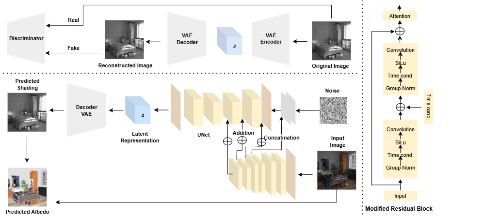
</p>

---

## 🎯 **What Makes FlowIID Special?**

<table>
<tr>
<td width="33%" align="center">

### ⚡ **Lightning Fast**
Single forward pass  
No iterative refinement  
Real-time ready

</td>
<td width="33%" align="center">

### 🎯 **Ultra Efficient**
Only **52M parameters**  
10x smaller than competitors  
Perfect for mobile/edge

</td>
<td width="33%" align="center">

### 🏆 **Best-in-Class**
SOTA results on benchmarks  
Superior visual quality  
Robust across domains

</td>
</tr>
</table>

---

## 🚀 **Try It Live - No Setup Required!**

<div align="center">

### 🔗 **[🌐 Launch Interactive Demo](https://huggingface.co/spaces/Mithleshsingla/FlowIID)**

[](https://huggingface.co/spaces/Mithleshsingla/FlowIID)

*Drag & drop any image → Get instant albedo & shading decomposition!*

</div>

---

## 🧠 **The Magic Behind Flow Matching**

<div align="center">
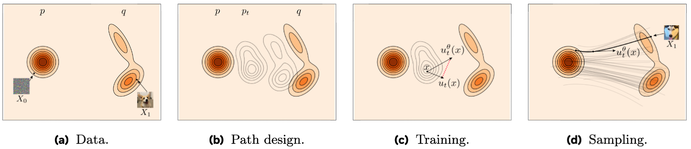
</div>

> **🔬 Flow Matching** learns to transform noise into realistic shading by solving ODEs  
> Unlike diffusion models that denoise step-by-step, we directly learn velocity fields for **instant** generation

**Flow Matching** is a generative modeling technique that learns to **transform a simple prior distribution (e.g., Gaussian) into a complex data distribution** by solving an Ordinary Differential Equation (ODE).

Instead of iteratively denoising (like diffusion models), flow matching directly learns a **velocity field** that tells us how to move particles in latent space toward realistic samples.

In this project:  
- We first compress shading images using a **VAE** into latent space.  
- Then, we train a **UNet-based flow matching network** on these latents.  
- We pass our input image to **Encoder** that passes features from last **3** layers to the **Unet** network.
- Then we apply **Euler's** method on our model output **(velocity)** to get the latent representation.
- We pass our latent representation through the decoder to get the output **Shading** image.
- Then we divide our input image with the **Shading** image to get the **Albedo** component: **A = I / S**.

### 🔄 **Our Pipeline in Action:**
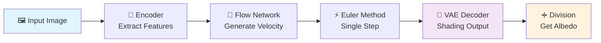

---

## 🏗️ **Architecture Deep Dive**

### 🔧 **Technical Specifications**

#### 🏛️ **VAE Components**
- **Encoder**: 6 downsampling blocks processing 3×H×W input
- **Decoder**: Generates shading from 8×H/8×W/8 latent representation
- **Latent space**: 8 × 32 × 32 for 256×256 input images

#### 🌊 **Flow Matching Network**
- **UNet**: 2 downsampling + 2 upsampling blocks with skip connections
- **Modified Residual Blocks (MRB)**: Integrated in both UNet and encoder
- **Feature fusion**: Encoder features from last 3 blocks added to UNet
- **Attention**: Selective attention layers for efficiency-accuracy balance

#### 📈 **Training Strategy**
1. **Stage 1**: VAE + Discriminator training (290 epochs total)
   - First 90 epochs: Reconstruction + KL + Perceptual loss
   - Next 200 epochs: Add adversarial loss
2. **Stage 2**: Flow Matching training (250 epochs)
   - Batch size: 32
   - Learning rate: 1×10⁻⁴

---

## 📐 **Mathematical Foundation**

### 🧮 **VAE Loss Functions**

**Reconstruction (L2) loss:**

```math
\mathcal{L}_{\text{rec}} = \|s_0 - \hat{s}_0\|_2^2
```

**Perceptual (feature) loss** (using a fixed feature extractor $\phi$, e.g., VGG):

```math
\mathcal{L}_{\text{perc}} = \|\phi(s_0) - \phi(\hat{s}_0)\|_2^2
```

**Kullback–Leibler divergence** (with prior $p(z) = \mathcal{N}(0, I)$ and posterior $`q_\phi(z \mid s_0)`$):

```math
\mathcal{L}_{\text{KL}} = D_{\text{KL}}\left(q_\phi(z \mid s_0)\,\|\,p(z)\right)
```

**Adversarial (GAN) loss:**

```math
\mathcal{L}_A = \mathbb{E}_{s_0} [\log (D (s_0))] + \mathbb{E}_z [\log (1 - D (G (z)))]
```

**Total VAE objective:**

For first 90 epochs:
```math
\mathcal{L}(E, D) = \mathcal{L}_{\text{rec}} + 0.005 \cdot \mathcal{L}_{\text{KL}} + \mathcal{L}_{\text{perc}}
```

For subsequent 200 epochs:
```math
\mathcal{L}(E, D) = \mathcal{L}_{\text{rec}} + 0.005 \cdot \mathcal{L}_{\text{KL}} + \mathcal{L}_{\text{perc}} + 0.1 \cdot \mathcal{L}_A
```

### 🌊 **Flow Matching Network**

**Flow Matching Loss:**

```math
\mathcal{L}_{\text{FM}} = \mathbb{E}_{t, x_t}\big[\,\|\,u_\theta(x_t, t) - v_t\,\|_2^2\big]
```

The flow matching network is based on **UNet + encoder features** and trained on latent representation of size **8 × 32 × 32**. The ODE is solved using **Euler method** with just **1** timestep.

---

## 🎨 **Stunning Results Gallery**

### 📸 **Real-World Examples**

<div align="center">

| 🖼️ **Input** | 🎨 **Albedo** | 🌗 **Shading** |
|:---:|:---:|:---:|
| 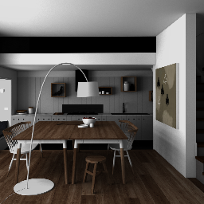<br/>*Portrait* | 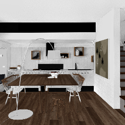<br/>*Surface Color* | 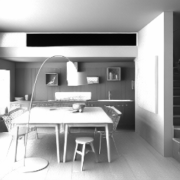<br/>*Lighting* |
| 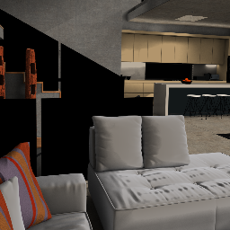<br/>*Interior Scene* | 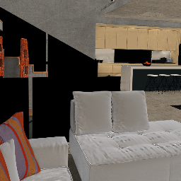<br/>*Material Properties* | 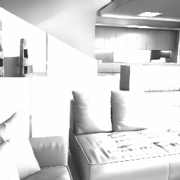<br/>*Light Distribution* |
| 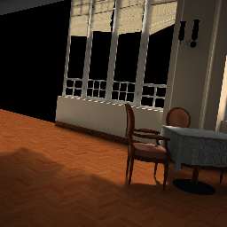<br/>*Object Study* | 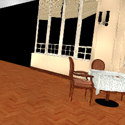<br/>*Intrinsic Color* | 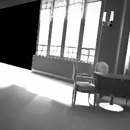<br/>*Shadow Patterns* |
| 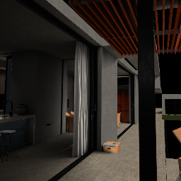<br/>*Outdoor Scene* | 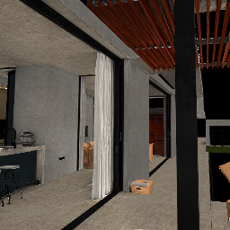<br/>*Surface Reflectance* | <br/>*Natural Lighting* |
| <br/>*Complex Scene* | 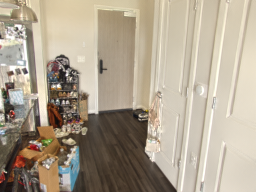<br/>*True Materials* | 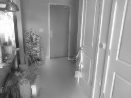<br/>*Illumination Map* |

</div>

### 🆚 **vs. State-of-the-Art**

<div align="center">
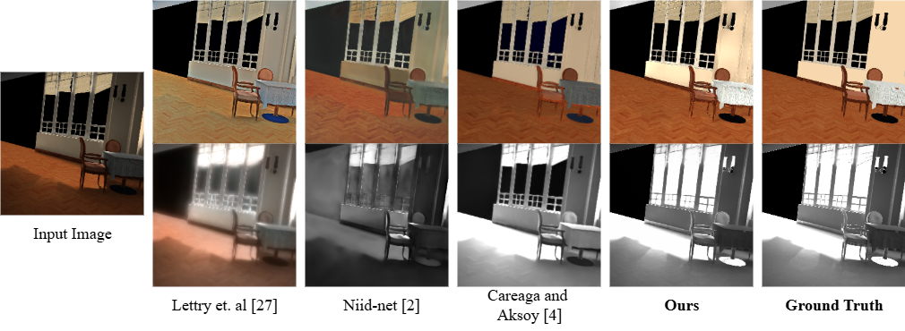

*FlowIID delivers superior decomposition quality with significantly fewer parameters*
</div>

---

## 📊 **Comprehensive Benchmark Results**

### 🏆 **ARAP Dataset - Complete Results**

#### 🎨 **Albedo Performance**
*Note: * implies model is finetuned on ARAP dataset*

| Method | LMSE↓ | RMSE↓ | SSIM↑ |
|:-------|:-----:|:-----:|:-----:|
| Niid-net* | 0.023 | 0.129 | **0.788** |
| Lettry et al. | 0.042 | 0.163 | 0.670 |
| Kocsis et al. | 0.030 | 0.160 | 0.738 |
| Zhu et al. | 0.029 | 0.184 | 0.729 |
| IntrinsicAnything | 0.038 | 0.171 | 0.692 |
| Careaga and Aksoy | 0.025 | 0.140 | 0.671 |
| PIENet | 0.031 | 0.139 | 0.718 |
| Careaga and Aksoy (2024) | 0.023 | 0.145 | 0.700 |
| **🥇 FlowIID (Ours)** | **🔥 0.021** | **🔥 0.108** | 0.760 |

#### 🌗 **Shading Performance**
*Note: * implies model is finetuned on ARAP dataset*

| Method | LMSE↓ | RMSE↓ | SSIM↑ |
|:-------|:-----:|:-----:|:-----:|
| Niid-net* | 0.022 | 0.206 | **0.781** |
| Lettry et al. | 0.042 | 0.193 | 0.610 |
| Careaga and Aksoy | 0.026 | 0.168 | 0.680 |
| PIENet | 0.037 | 0.170 | 0.718 |
| **🥇 FlowIID (Ours)** | **🔥 0.022** | **🔥 0.132** | 0.744 |

### 🎯 **MIT Intrinsic Dataset - Complete Results**

<div align="center">

| Method | **Albedo** ||| **Shading** |||
|:-------|:----------:|:----------:|:----------:|:----------:|:----------:|:----------:|
|| MSE↓ | LMSE↓ | DSSIM↓ | MSE↓ | LMSE↓ | DSSIM↓ |
| CasQNet | 0.0091 | 0.0212 | 0.0730 | 0.0081 | 0.0192 | 0.0659 |
| PAIDNet | 0.0038 | 0.0239 | 0.0368 | **🔥 0.0032** | 0.0267 | **🔥 0.0475** |
| USI3D | 0.0156 | 0.0640 | 0.1158 | 0.0102 | 0.0474 | 0.1310 |
| CGIntrinsics | 0.0167 | 0.0319 | 0.1287 | 0.0127 | 0.0211 | 0.1376 |
| PIENet | **🔥 0.0028** | 0.0126 | **🔥 0.0340** | 0.0035 | 0.0203 | 0.0485 |
| **🥇 FlowIID (Ours)** | 0.0040 | **🔥 0.0043** | 0.0435 | 0.0109 | **🔥 0.0119** | 0.0823 |

*FlowIID achieves the best LMSE scores for both albedo and shading, demonstrating superior perceptual quality*

</div>

---

## 🔹 **Dataset Preprocessing Pipeline**

Our comprehensive preprocessing ensures high-quality training data:

1. **Download datasets** (Hypersim, InteriorVerse, MID)  
   - Extract **albedo** and **HDR** images.  
2. **Tonemap HDR → LDR** (without gamma correction).  
3. **Normalize** to range [0, 1].  
4. **Compute shading ground truth**:  
   
   ```math
   \text{Shading} = \frac{\text{HDR}}{\text{Albedo}}
   ```

5. Final ground truth images:  
   - Albedo  
   - Shading  
   - LDR input image  

---

## 🚀 **Quick Start Guide**

### 📦 **Installation**
```bash
# Clone the repository ✨
git clone https://github.com/mithleshsingla/FlowIID.git
cd FlowIID

# Install dependencies 📋
pip install -r requirements.txt
```

### ⚡ **Instant Inference**
```bash
# Decompose any image in seconds! 🎯
python inference.py \
    --input_path /path/to/your/image.png \
    --output_path /path/to/output/folder
```

### 🏋️ **Training from Scratch**
```bash
# Train VAE (Stage 1) 🏗️
python src/train_vae.py --config config/autoen_alb.yaml

# Train Flow Network (Stage 2) 🌊  
python src/train_unet.py --config config/unet_hyperism.yaml
```

### 📈 **Evaluation**
```bash
# Benchmark on ARAP dataset 📊
python eval/eval_arap.py

# Test on MIT Intrinsic dataset 🎯
python eval/eval_mit.py
```

---

## 🗂️ **Project Structure**

```
FlowIID/
├── 📄 README.md                # You are here!
├── 📋 requirements.txt         # Dependencies
├── 🏋️ checkpoints/            # Pretrained weights
├── ⚙️  config/                # YAML configurations  
├── 🔄 data_preprocessing/     # Dataset preparation
├── 📊 docs/                   # Figures & visualizations
├── 📈 eval/                   # Evaluation scripts
├── 🏗️ models/                # Network architectures
├── 🔬 src/                    # Training scripts
└── ⚡ inference.py           # Ready-to-use inference
```

---

## 🌟 **Key Features**

<div align="center">

### 💎 **Perfect for:**
🎮 **Game Development** • 🎬 **Film VFX** • 📱 **Mobile Apps** • 🤖 **Robotics** • 🎨 **Digital Art**

### ⭐ **Key Advantages:**
- ✅ **Real-time performance** - Single forward pass
- ✅ **Memory efficient** - Only 52M parameters  
- ✅ **Plug & play** - Easy integration
- ✅ **Robust** - Works across diverse images
- ✅ **State-of-the-art** - Superior benchmark results

</div>

---

## 🤝 **Contributing**

We welcome contributions! Whether it's:
- 🐛 Bug fixes
- ✨ New features  
- 📖 Documentation improvements
- 🧪 Experimental extensions

Feel free to open issues or submit pull requests!

---

<div align="center">

### 🚀 **Ready to decompose images like never before?**

[](https://github.com/mithleshsingla/FlowIID)
[](https://huggingface.co/spaces/Mithleshsingla/FlowIID)


</div>
